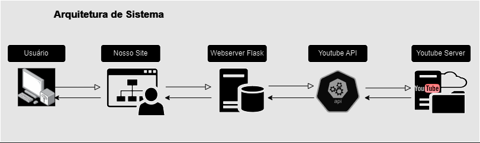
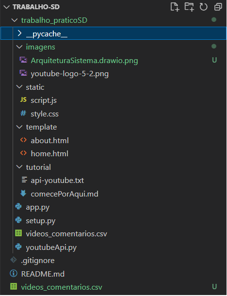

# YoutubeComments

O projeto **YoutubeComments** foi desenvolvido como parte da disciplina de Sistemas Distribuídos do curso de Ciência da Computação da Universidade Federal de Lavras (UFLA). O objetivo do projeto é realizar Web Scraping em vídeos do Youtube utilizando Flask. Isso permite obter informações sobre 5 vídeos relacionados a um tema específico, incluindo 5 comentários para auxiliar na decisão de assistir ou não ao vídeo. O projeto é desenvolvido em Python, com a interface do usuário em HTML, e foi utilizado o VSCode como plataforma de desenvolvimento.

## Índices
- [Arquitetura](#arquitetura)
- [Instalação](#instalação)
- [Como criar a chave da API do Youtube](#como-criar-a-chave-da-api-do-youtube)
- [Como Usar](#como-usar)
- [Exemplos de Uso](#exemplos-de-uso)
- [Configuração](#configuração)
- [Contribuição](#contribuição)
- [Contato](#contato)

## Arquitetura
A arquitetura do projeto é projetada para atender às solicitações dos clientes, encaminhando-as para a API do YouTube e retornando as respostas apropriadas aos clientes. Este fluxo é facilitado por uma **arquitetura centralizada e baseada em eventos**.

### Arquitetura de Sistema



### Componentes Principais
#### Cliente: 

- O cliente inicia a interação, enviando solicitações para o servidor por meio do clique no botão.

#### Servidor:

- Nosso servidor atua como um intermediário entre o cliente e a API do YouTube.
- Recebe as solicitações do cliente.
- Encaminha essas solicitações para a API do YouTube.

#### API do YouTube:

- A API do YouTube processa as solicitações recebidas do nosso servidor.
- Retorna os resultados pertinentes ao nosso servidor.

### Fluxo de Comunicação
1. O cliente envia uma solicitação para o nosso servidor, sendo ela a pesquisa de um assunto no Youtube.
2. O servidor recebe a solicitação do cliente e encaminha a solicitação para a API do YouTube.
3. A API do YouTube processa a solicitação e retorna os resultados relevantes ao nosso servidor.
4. Nosso servidor recebe a resposta da API do YouTube e a encaminha de volta ao cliente.

### Estrutura de Eventos
- **Solicitação do Cliente**: Evento desencadeado quando o cliente faz uma requisição ao servidor.
- **Encaminhamento para a API**: Evento desencadeado quando o servidor encaminha a solicitação do cliente para a API do YouTube.
- **Resposta da API**: Evento desencadeado quando a API do YouTube responde ao servidor.
- **Resposta ao Cliente**: Evento desencadeado quando o servidor envia a resposta da API de volta ao cliente.


### Arquitetura de Software

## Instalação

Certifique-se de ter o Python e o pip instalados. Execute o seguinte comando para instalar as dependências necessárias:

```bash
pip install .
```

Lembre-se de que, ao usar o pip install ., é recomendável estar no diretório raiz do seu projeto onde o setup.py está localizado.

Isso instalará todas as dependências listadas no arquivo setup.py. Se preferir instalar manualmente, você também pode usar os comandos individuais:
```bash
pip install flask
pip install google-auth-oauthlib
pip install google-auth
pip install google-api-python-client
pip install matplotlib
pip install wordcloud
pip install nltk
```

## Como criar a chave da API do Youtube
Antes de usar o projeto, é necessário criar uma chave da API do Youtube.
Para acessar o Console de APIs do Google e começar a usar a API do YouTube Data, siga estes passos:

1. Primeiro, é necessário ter uma Conta do Google para acessar o Console de APIs, solicitar uma chave de API e registrar seu aplicativo.

2. Inicie criando um projeto no [Google Developers Console] (https://console.developers.google.com/?hl=pt-br) para obter as credenciais de autorização. Isso permitirá que seu aplicativo envie solicitações de API.

3. Após criar o projeto, verifique se a API do YouTube Data está habilitada para uso pelo seu aplicativo:
  a. Acesse o Console de APIs e selecione o projeto recém-criado.
  b. Vá para a página de APIs ativadas. Verifique na lista de APIs se a API do YouTube Data v3 está habilitada e com status ATIVADO para garantir seu 
  funcionamento corretamente pelo aplicativo.

Para mais informações consulte o site: [Visão geral da API YouTube Data] (https://developers.google.com/youtube/v3/getting-started?hl=pt-br)

## Como usar o projeto
Para usar o projeto, siga estas etapas:

1. Clone o repositório para o seu ambiente local:
```bash
git clone https://github.com/seu-username/YoutubeComments.git
```
2. Abra o terminal na pasta do projeto.
3. No arquivo **youtubeApi.py** modifique a linha 6 do código e insira sua chave API do Youtube.
```bash
# Substitua 'YOUR_API_KEY' com a sua chave de API
api_key = "YOUR_API_KEY"
```
4. Execute o comando:
```bash
python app.py
```
5. Abra o navegador e vá para http://127.0.0.1:5000/.
6. Insira o termo de pesquisa na caixa de texto e clique em "Pesquisar".

## Exemplos de Uso
- Após a pesquisa, você receberá uma lista de vídeos do Youtube relacionados ao termo pesquisado.
- Cada vídeo inclui um link para o vídeo no Youtube, os cinco primeiros comentários e uma nuvem de palavras com as palavras mais comentadas.

## Configuração
Não é necessário configurar nada além das instruções de instalação. Certifique-se de ter uma conexão com a internet para acessar o Youtube.

## Contribuição
Se quiser contribuir para o projeto, siga os passos abaixo:
1. Faça um fork do repositório no GitHub.
2. Clone o fork para o seu ambiente local:
```bash
git clone https://github.com/seu-username/YoutubeComments.git
```
3. Crie uma branch para suas alterações:
```bash
git checkout -b minha-contribuicao
```
4. Faça as alterações desejadas.
5. Commit e push para o seu fork:
```bash
git add .
git commit -m "Minha contribuição"
git push origin minha-contribuicao
```
6. Abra um pull request no repositório original.

## Contato
Para sugestões ou mais informações, entre em contato:
- [@dudaGrossi](https://github.com/dudaGrossi) - maria.grossi1@estudante.ufla.br
- [@matheusdinizdev](https://github.com/matheusdinizdev) - matheus.diniz@estudante.ufla.br
- [@raissaro](https://github.com/raissaro) - raissa.oliveira@estudante.ufla.br
